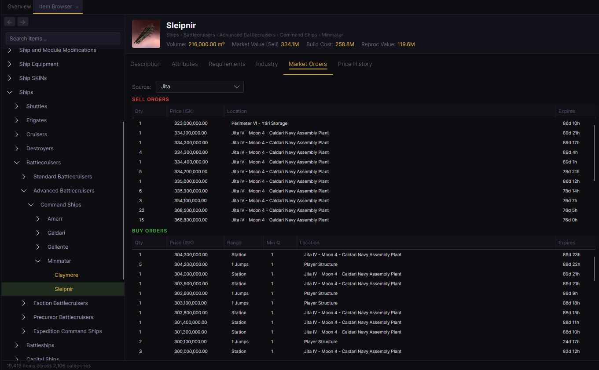
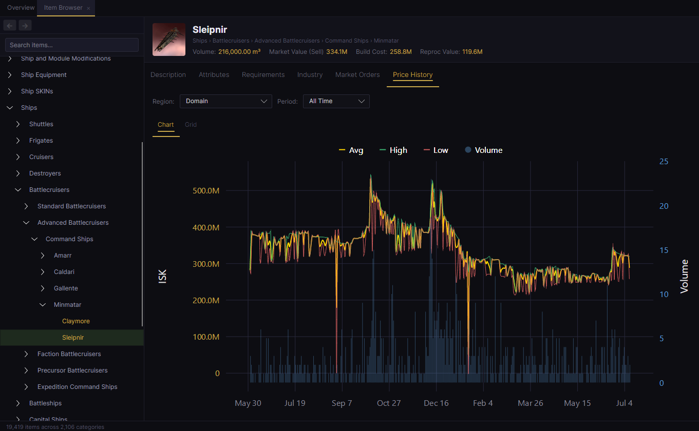
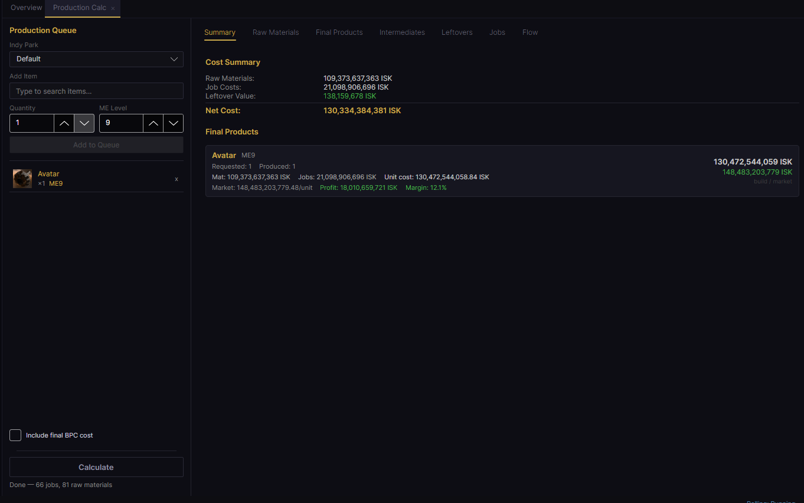
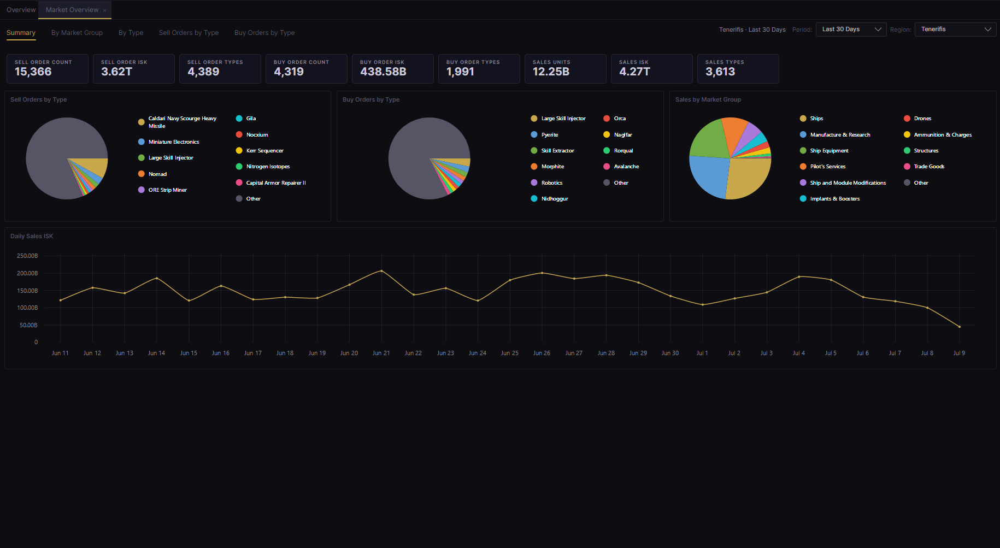
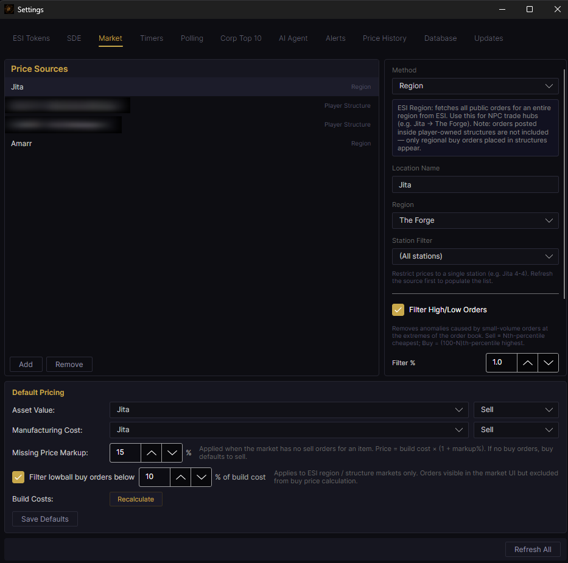
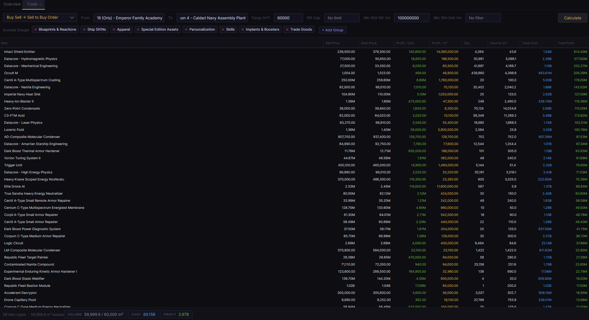
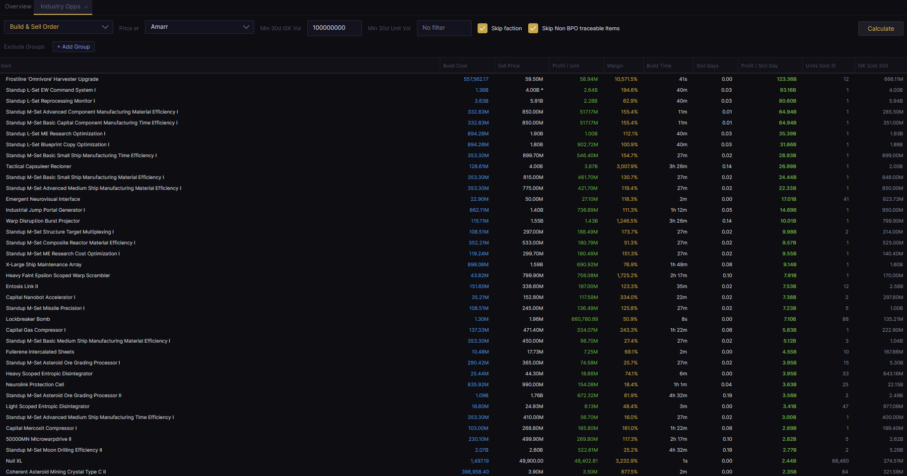
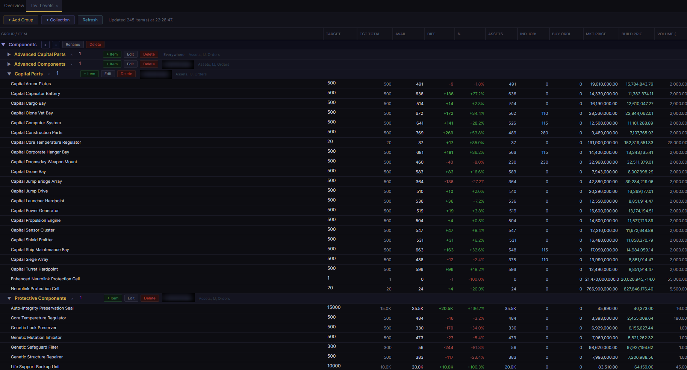
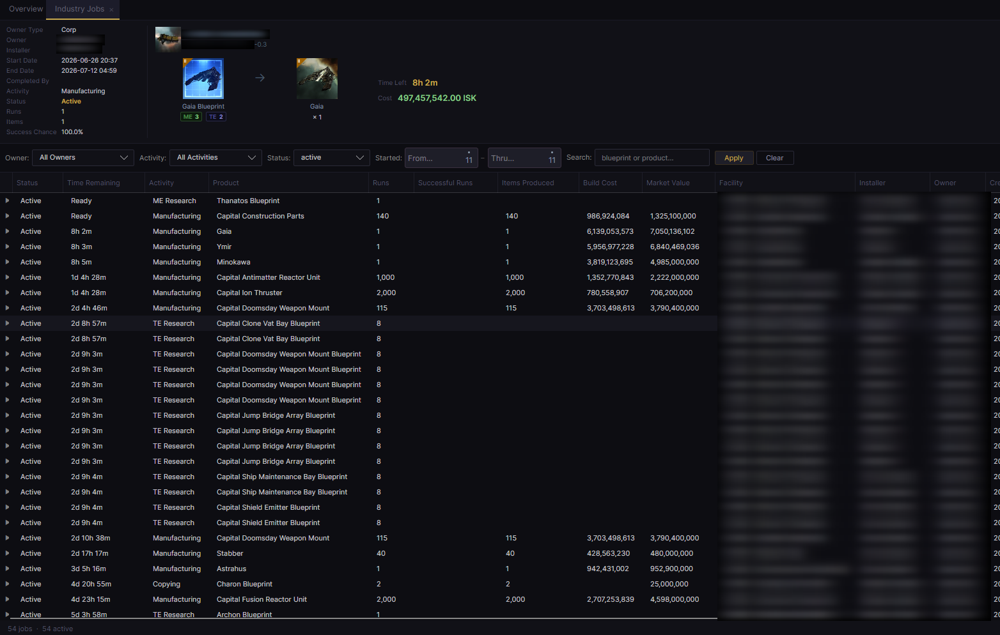
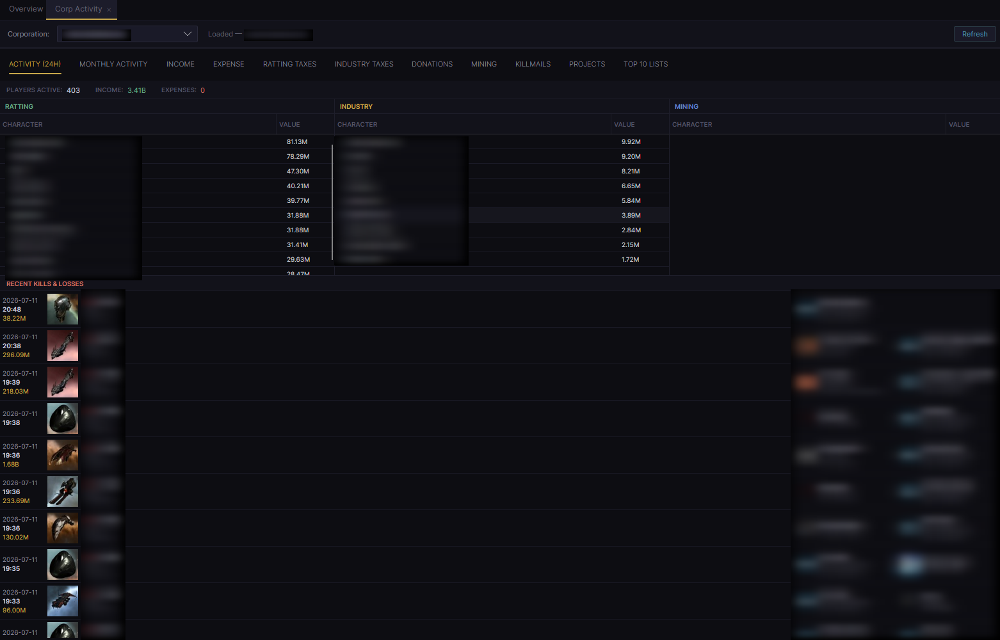

<p align="center">
  
</p>

<p align="center"><em>A local-first, free, open-source desktop companion for EVE Online.</em></p>

<p align="center">📖 <strong><a href="https://docs.eveconsole.com/">Documentation</a></strong></p>

**EVE Console** is a desktop companion app for [EVE Online](https://www.eveonline.com/), running locally on the players system.  Ultimately I run many tools for my day to date activities in Eve (i.e., Ravworks, jEveAssets, Excel, etc.), and was looking for a single tool, where all of my data stayed local, and was completely free with source.  While the tool does not do everything today, it does the things I need it to do.  There is an AI agent integrated into the application, and it was added as I needed to play around with it to get some better familiarity in agent integration for my job, so we ended up with it in this tool.  It does have access to view all of the data in the tools DB, so possibly can answer questions that the UI is not setup to do.  Agent does come with optional TTS and voice input.  Included a number of both external paid options, as well as local alternatives to provide a variety of options, and also for me to get a little exposure with each.  That all being said, it will not be active unless you actually set it up, so you can ignore it if you choose.

I am currently developing and testing this on Windows, but the intent is to eventually provide builds for both Windows and Linux, which is why I ultimately went with Avalonia.  This will likely happen when I get to a point where I am okay with the functionality for the 1.0.0 release.

Keep in mind this application is still very green.  You are free to play around with it, but do expect issues during use.  Do not give up your old tools for this quite yet.  Needs a bit of a hardening period.

> **Status:** Beta (`0.9.x`). Actively developed — expect rough edges.

---

## Screenshots

<!-- Thumbnails are 3-across; click any image to view it full size. Add more as <td> cells, 3 per <tr>. -->
<table align="center">
  <tr>
    <td align="center" width="33%">
      <a href="media/screenshots/Screenshot1.png"></a>
    </td>
    <td align="center" width="33%">
      <a href="media/screenshots/Screenshot2.png"></a>
    </td>
    <td align="center" width="33%">
      <a href="media/screenshots/Screenshot3.png"></a>
    </td>
  </tr>
  <tr>
    <td align="center" width="33%">
      <a href="media/screenshots/Screenshot4.png"></a>
    </td>
    <td align="center" width="33%">
      <a href="media/screenshots/Screenshot5.png"></a>
    </td>
    <td align="center" width="33%">
      <a href="media/screenshots/Screenshot6.png"></a>
    </td>
  </tr>
  <tr>
    <td align="center" width="33%">
      <a href="media/screenshots/Screenshot7.png"></a>
    </td>
    <td align="center" width="33%">
      <a href="media/screenshots/Screenshot8.png"></a>
    </td>
    <td align="center" width="33%">
      <a href="media/screenshots/Screenshot9.png"></a>
    </td>
  </tr>
  <tr>
    <td align="center" width="33%">
      <a href="media/screenshots/Screenshot10.png"></a>
    </td>
    <td align="center" width="33%"></td>
    <td align="center" width="33%"></td>
  </tr>
</table>

---

## Features

### Under the hood
- Background ESI pulls.  As long as application is running, data will refresh, and most UIs will automatically reflect those updates
- Definable market price definition, along with calculation and storage of price per item as market prices are refreshed.  This includes the ability to parse out lowball/highball prices, and base price calculations on % over build costs.  Useful for capitals and especially supers/titans.
- Ability to define detailed indy park, including different structures for different categories of items, as well as structure exceptions for specific items.  These are used for industry calculations.
- System calculates and stores the build cost for every craftable item in the game, and this updates as market prices are updated
- Build costs price blueprint copies off actual contracts (per run and by ME), and take the cheaper of building or buying each component
- Tranquility status sits in the header, and ESI polling pauses on its own while the server is down
- Database tab reports the size of every table, and can shrink, move or rename the database
- Data retention rules for the error log, killmails, price history, game logs and chat, swept in the background at least daily
- Optional zKillboard supplement.  ESI only hands you a killmail if you were the victim or got the final blow, so fleet participation is otherwise invisible

### Industry / Trade
- Market Levels - Allows you to monitor a specific definable market for inventory of sell orders on a specific list of items
- Inventory Levels - Allow you to monitor your current inventory amounts (plus in build, buy, etc.) of a definable list of items (similar to jEveAssets stockpiles)
- Trade Opportunities - Compares markets for opportunities between them
- Net Worth - A Chart with lines to make you feel better/worse
- Production Calculator - Accurate calculation of production jobs for the player.  Includes build costs, materials needed, etc.  Reports what you are missing and turns it into a shopping list
- Market Overview - What you have on the market, broken down by market group.  Sell and buy order units and ISK, alongside what has actually sold
- Worklist - One list of what to do next, rebuilt from live ESI data every refresh.  Nine sources you can switch on and off independently - industry jobs, logistics, invention and copying, material purchases, standing buy orders, inventory levels, corp projects, skill queues and asset safety
- Order Tracker - Track items you have agreed to supply.  Pending orders are matched against stock, active industry jobs and the contracts that deliver them, so an order completes itself when the contract is accepted
- Standing Buy Orders - Declare the buy orders you intend to keep standing at a station or structure, and see whether they are actually there, outbid, or nearly expired
- Sale Posting - Build shareable sale postings from your stock, with build/market/contract pricing and a configurable sale price.  Renders to Plain, Slack, Discord, Markdown, HTML or BBCode
- Sales Tracker - What has sold, for how much, and against what it cost you
- LP Market Values - What your loyalty points are actually worth, offer by offer, priced against the market
- Contracts - Browse your contracts and their items
- Industry Jobs - Every running job, with a check on whether it is actually getting the rig bonus you planned for
- Industry Opportunities - What is worth building right now
- Price Overrides - Pin a price when you disagree with the market

### Universe / Navigation
- Universe Map - One continuous map of New Eden, from the whole cluster down to a single system.  Overlays colour systems by security, kills, jumps, industry indices, sovereignty, stations, planetary output and intel sightings
- System pages - Celestials, kills, industry indices, agents, graphs and intel sightings for any system
- Jump Planner - Capital route planning with draggable waypoints and midpoints, jump-through structures, and the fuel and distance for each leg
- Structure Browser - Player structures pulled from the public structure list rather than only the ones you happen to have visited.  Links to Indy Parks so a park can name a real facility

### Intel / Logs
- Intel parsing - Reads your intel channel logs, works out who was seen where and in what, and puts the sightings on the map
- Game Log and Chat Log viewers - Search your local EVE logs, with past history importable in bulk
- Session tracking - Which characters are online, where they are, and what they are flying

### Corporation
- Activity monitor to track income from ratting, industry, etc., as well as mining activity, kills, and corp project activity
- Corp Projects - View active and historical corp project details
- Standing projects - Allows you to define projects you want to always maintain (i.e., destroy NPC projects in any system in region X with ADM below 4.0)
- Top 10 Lists - Produces activity top 10 lists based on corp ESI data

### Other
- Character Viewer - Similar to the one in game in case you are abstaining from logging your character in for some reason
- Item Browser - Full items browser, and description/attributes/etc. of every item in the game.  Also includes current market orders and price history for defined markets.
- Asset Viewer - Search across all personal and corp assets
- Killmail viewer - Corp and personal, or everything in New Eden if you turn the zKillboard feed on
- Player Entities - Every pilot, corp and alliance the app has met in a killmail, contract or chat log, with kills, losses and member counts
- NPC Entities - Agents, NPC corporations and factions out of the SDE.  Search an agent by name, or ask what is in a station
- Alerts - On the overview of the main screen alerts will show for things the tool believes you should look at (definable)
- Alarms - Conditions you define, checked on a timer, that tell you when something has happened.  Says it once rather than every time it checks
- Eve Mail - Read and write eve mail... just because
- Notifications - Your in-game notifications, without logging in
- Slack - Optional.  Sends alerts to a direct message with yourself
- ESI Explorer - Poke at the raw ESI data the app holds

### AI Agent ("Eden")
- Built-in conversational assistant with access to your character/corp data via tool calls
- Configurable to use external (Claude/OpenAI) or local (i.e., Ollama)
- Optional text-to-speech (Piper local TTS or ElevenLabs) and speech-to-text (local Whisper or OpenAI) for hands-free interaction
- Customizable name and voice

---

## Tech stack

- [Avalonia UI](https://avaloniaui.net/) 11 (cross-platform XAML UI framework) — currently built and tested on Windows (`net9.0-windows`)
- .NET 9, [ReactiveUI](https://www.reactiveui.net/) (MVVM)
- EF Core 9 with SQLite for local persistence
- [LiveChartsCore](https://livecharts.dev/) for charts
- CCP's [ESI API](https://esi.evetech.net/ui/) for all game data, with local caching of the Static Data Export (SDE)

---

## Getting started

### Requirements
- Windows 10/11
- [.NET 9 SDK](https://dotnet.microsoft.com/download/dotnet/9.0)

### Build & run

```powershell
git clone https://github.com/kernoeve/EveConsole.git
cd EveConsole
dotnet restore
dotnet run
```

On first launch, a **Welcome** dialog appears and the Settings window opens on the **ESI Tokens** tab — click **Add Character** there to authorize a character via EVE's SSO. Your data is stored locally in SQLite at `%LOCALAPPDATA%\EveConsole\EveConsole.db`. See the [documentation](https://docs.eveconsole.com/getting-started/) for full install and setup steps.

---

## Contributing

This project uses a `develop` → `main` branching model:

- `main` is the protected release branch — every merge into it triggers an automated build and gets tagged with an auto-incrementing patch version (`vMAJOR.MINOR.PATCH`).
- `develop` is the integration branch — branch your work off `develop` (`feature/your-thing`, `fix/your-thing`) and open a pull request back into it.
- Periodic `develop → main` PRs cut a new release.

---

## License

EVE Console is licensed under the [GNU General Public License v3.0](LICENSE).

---

*EVE Console is a third-party tool and is not affiliated with or endorsed by CCP Games. EVE Online and the EVE logo are trademarks of CCP hf.*
